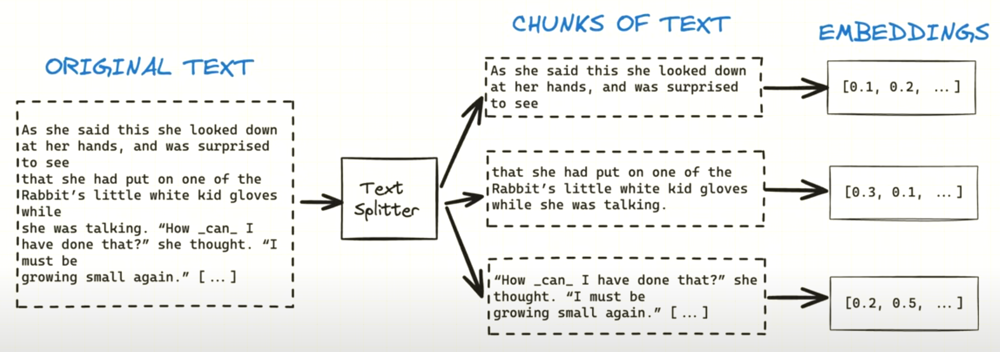
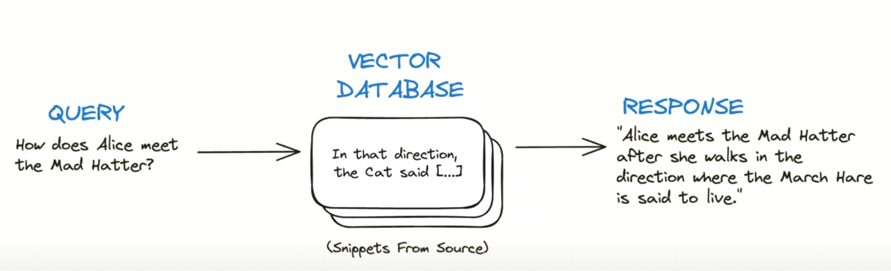

# RAG (Retrieval Augmented Generation) with Local LLMs

We'll see how to get LLM running locally on the computer using open source LLMs, we'll also see how to update the vector database with new entries. So, if you want to add or modify entry you can do that without to rebuild the entire database from scratch.

**Agenda**:
- Running RAG Locally
- Updating Your Local DB
- Testing RAG Output

**Quick Recap**:
- We have our original database, which we'll split into chunks and convert into vectors.
  
- Then when we want to ask a question, we'll also turn on our query into an embedding, which will help us fetch the most relevant entries from the database.
  
- We'll then pass these fetched entries together in the prompt and that's how we'll get our final response.

## Embedding function:
Once the document is split into chunks, we'll have to create embedding for each chunk. This will become something like a key for a database.
