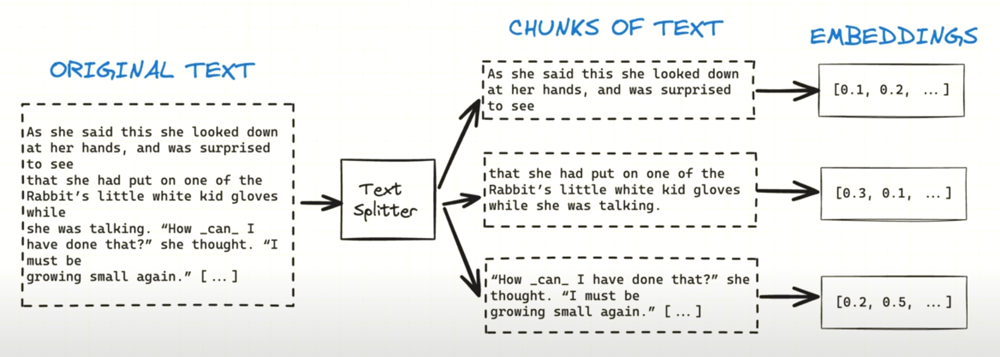
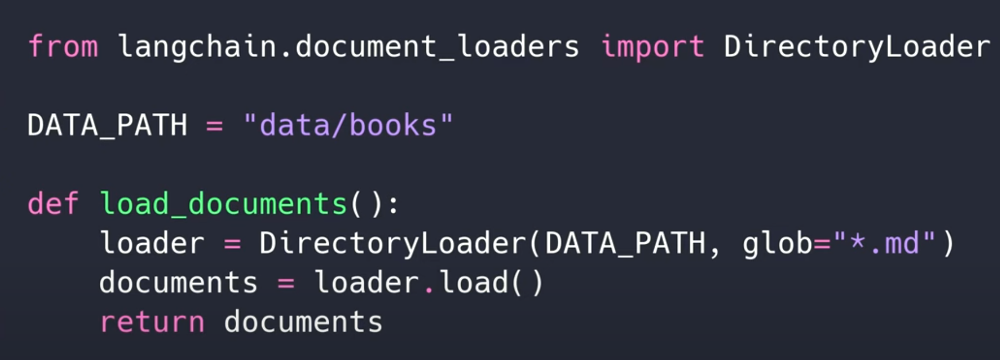
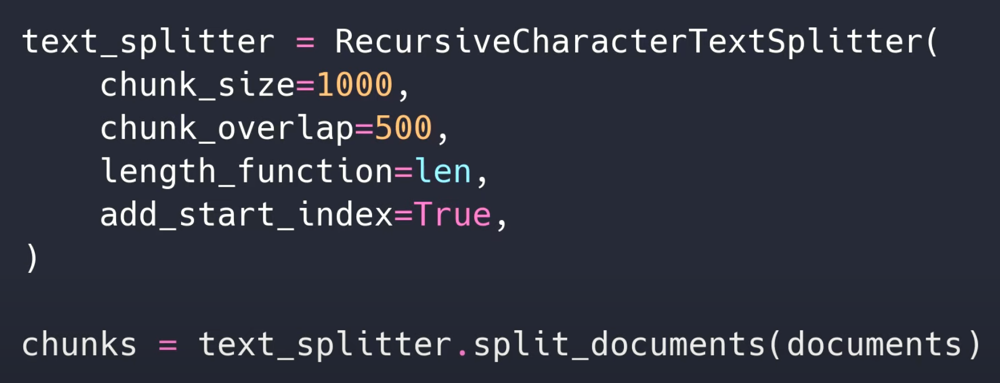
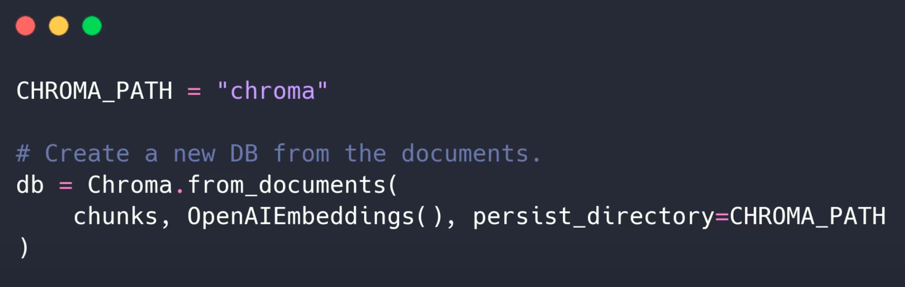

# RAG + Langchain Python Project: AI chat for your docs

>NOTE: This project is a Python implementation of the [RAG](https://arxiv.org/abs/2005.11401) model, which is a retrieval-augmented generation model that can be used for open-domain question answering. The model is trained on a combination of a retrieval model and a generation model, which allows it to generate answers to questions that are not present in the training data. The model is trained on a large corpus of text data, and can be fine-tuned on a smaller dataset to improve performance on a specific task.

## Table of Contents
- The first step is preparing the dataset, we can get the proprietary data that we need, split it into chunks, and then convert it into a format that can be used by the model.
  
- Let's say you have all the .md files and you want to load it. we can do it simply using langchain.
  
- If your one document is too long, than it is recommended to split the document into multiple chunks.
  
- Code to split the document into multiple chunks. (`create_database.py`)
- Once the data chunks is prepared, we need to store this data into a datastore, which in our case will be `chroma` database
  - https://github.com/chroma-core/chroma
  - Chroma is the AI-native open-source vector database. Chroma makes it easy to build LLM apps by making knowledge, facts, and skills pluggable for LLMs.
  - To store created chunks, we can use chroma database as shown below.
  
